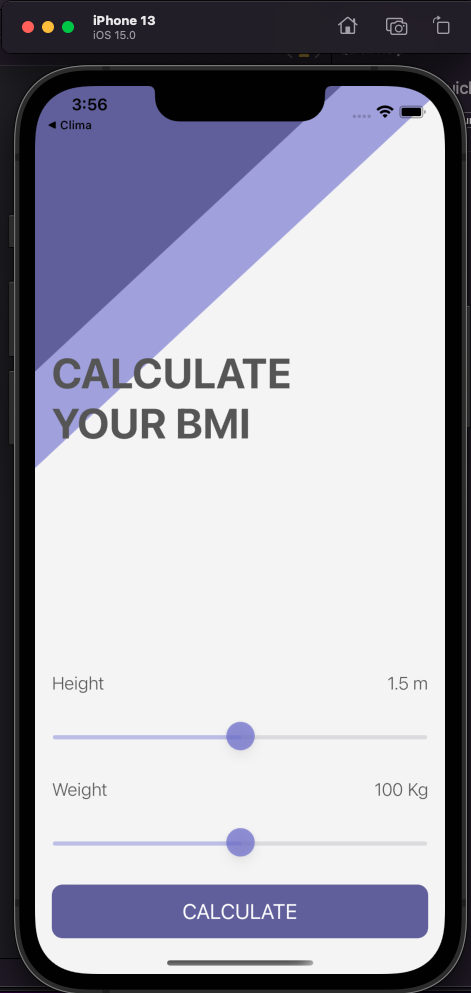
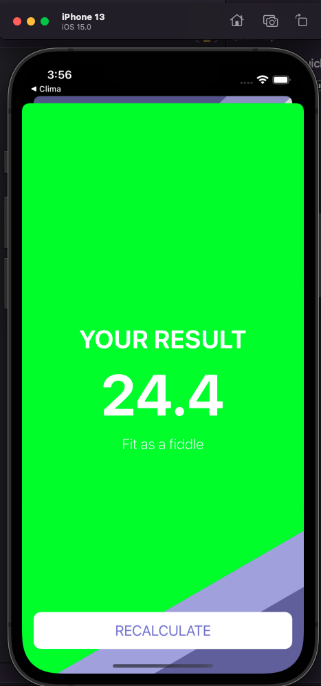
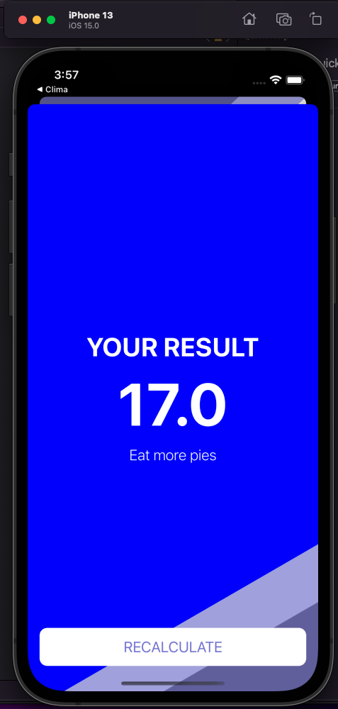
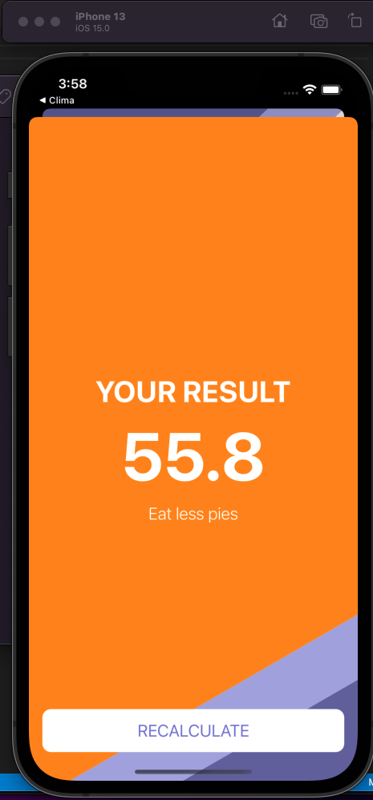

#  BMI Calculator

## Our Goal

The goal of this tutorial is to learn more about Optionals, solidify your understanding of the MVC design pattern and to introduce the concept of Classes. We’ll compare objects created from classes with instances of Structs.

## What I've created

By the end of the this project, we have made a Body Mass Index calculator. Based on the user’s weight and height it will calculate their body mass and give a piece of health advice depending on whether if they have eaten too many pies or if they need to eat more pies. 

## What I've learned

* How to create multi-screen apps with animated navigation.
* Optional binding, optional chaining and the nil coalescing operator.
* How to create classes and difference between classes and structs. 
* Pass by value vs. pass by reference. 
* Formatting Strings. 
* Color literals.

  
&nbsp; &nbsp; &nbsp; &nbsp;
  
&nbsp; &nbsp; &nbsp; &nbsp;
  
&nbsp; &nbsp; &nbsp; &nbsp;
  

>This is a companion project to The App Brewery's Complete App Development Bootcamp complete by Luiz Silva.